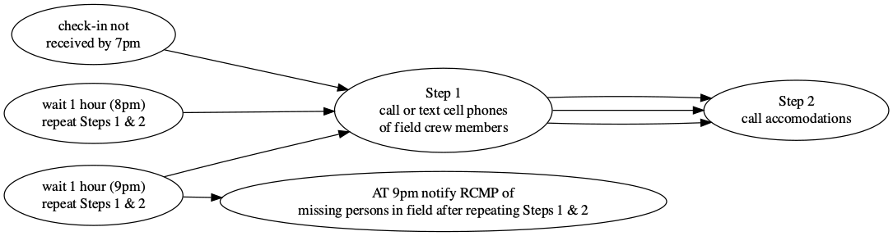
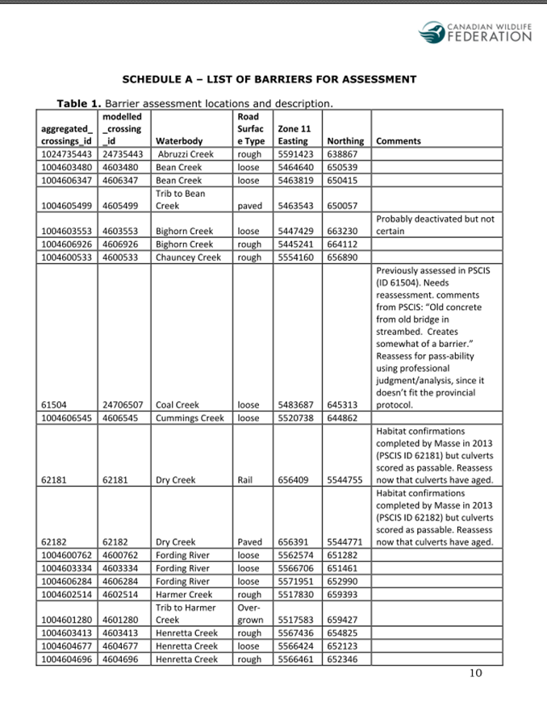
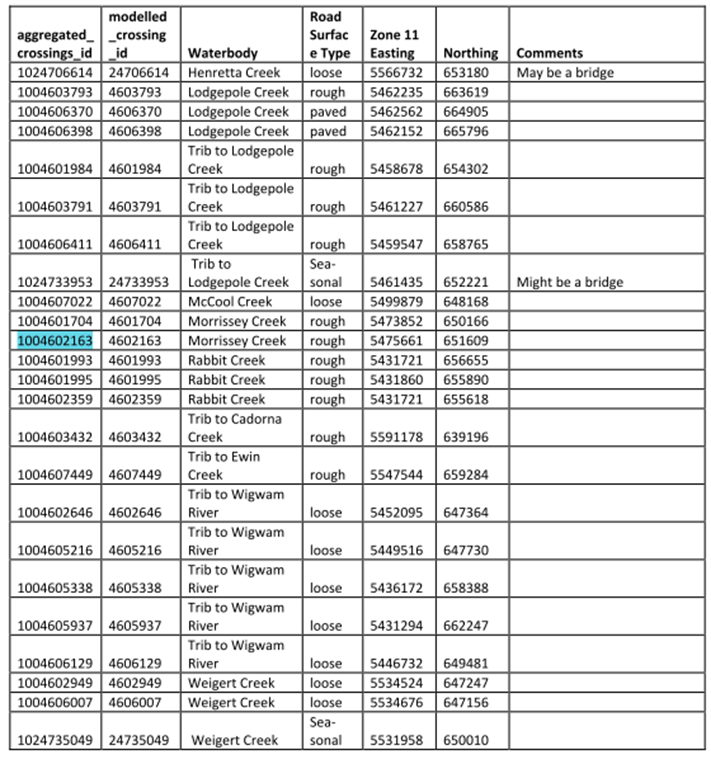
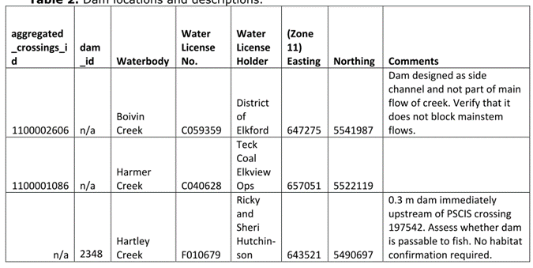

{.logo} 


 

<br>

::: from
Al Irvine  
New Graph Environment  
al@newgraphenvironment  
250-777-1518  
Date: `r format(Sys.Date(), "%Y-%m-%d")` 
:::


<!-- Ministry of Environment  -->
<!-- Skeena Region   -->
<!-- 3726 Alfred Ave 1st Floor   -->
<!-- Smithers, BC V0J 2N0   -->


```{r setup, include = TRUE, echo =FALSE, message=FALSE, warning=FALSE}
# gitbook_on <- TRUE
gitbook_on <- FALSE  ##we just need turn  this on and off to switch between gitbook and pdf via paged.js


knitr::opts_chunk$set(echo=FALSE, message=FALSE, warning=FALSE, dpi=60, out.width = "100%")
options(scipen=999)
options(knitr.kable.NA = '--') #'--'
options(knitr.kable.NAN = '--')

source('R/packages.R')
source('R/functions.R')
source('R/private_info.R')

name_project_number <- '2021-041'
# name_project_number2 <- '2021-040'
name_project_name <- 'nupqu-elk-fish-passage'
name_repo <- 'safety_plan_2021-041-nupqu-elk-fish-passage'
name_pdf <- 'safety_plan'
name_project_complete <- paste0(name_project_number, '-', name_project_name)

link_repo <- paste0('https://newgraphenvironment.github.io/', name_repo, '/')
link_kml <- paste0('https://github.com/NewGraphEnvironment/', name_repo, '/raw/main/mapping/sites_', name_project_name, '_', format(Sys.Date(), '%Y%m%d'), '_kml_gpx.zip')
link_pdf <- paste0('https://github.com/NewGraphEnvironment/', name_repo, '/raw/main/docs/', name_pdf, '_', name_project_name, '.pdf')
link_fieldmaps <- 'https://hillcrestgeo.ca/outgoing/fishpassage/projects/elk/'
# link_fieldmaps2 <- 'https://hillcrestgeo.ca/outgoing/fishpassage/projects/morice/' 

##this is reduntant but allows us to keep the gitbook seting for if we move to a better TOC
font_set <- 9


hotel1 <- 'Unit 216 - 1500 McDonald Avenue Fernie, BC - Contact - Matthew 	4c7154ee60d1c8@reply.fantasticstay.com'
hotel2 <- 'Unit 305 - 1500 McDonald Avenue Fernie, BC - Contact - Bob 4c7154ee60d1c7@reply.fantasticstay.com'

```


<br>

# `r paste0('Safety Plan - ',name_project_complete)`  {.unnumbered .break-after-me}

The latest version of this pdf can be downloaded [here](`r knitr::asis_output(link_pdf)`).


<br>


A zip file which includes kml (google earth) and gpx (garmin) files of the sites to be potentially assessed can be downloaded [here](`r knitr::asis_output(link_kml)`). Georeferenced pdf maps can be accessed and downloaded [here](`r knitr::asis_output(link_fieldmaps)`).

<br>

**Accomodations**

Al - `r hotel1`  
Brody - `r hotel2`


```{r info-hospitals}
hospital_name <- 'Elk Valley Hospital'
hospital_phone <- '250-423-4453'
hospital_address <- '1501 5 Ave, Fernie, BC V0B 1M0'


hospital_name2 <- 'Elkford Health Centre - Interior Health Authority'
hospital_phone2 <- '250-865-2247'
hospital_address2 <- '212 Alpine Way, Elkford, BC V0B 1H0'
```


```{r accomodations}

```

```{r settings-gitbook, eval= gitbook_on}
photo_width <- "100%"
font_set <- 11

```

```{r settings-paged-html, eval= identical(gitbook_on, FALSE)}
photo_width <- "80%"
font_set <- 9
```

```{r import-projects}


##Read in the contacts spreadsheet
####--------------bring in the habitat and fish data------------------
projects <-  readxl::excel_sheets(path = "./data/projects.xlsx") %>%
  purrr::set_names() %>%
  purrr::map(read_excel,
             path = "./data/projects.xlsx",
             .name_repair = janitor::make_clean_names) %>%
  purrr::set_names(janitor::make_clean_names(names(.))) %>%
  purrr::map(at_trim_xlsheet) %>% #this is the clean run of this function
  purrr::map(plyr::colwise(type.convert))

```

```{r  tab-overview}
tab_overview <- projects %>% 
  pluck('projects') %>% 
  filter(project_number == name_project_number) %>% 
  select(project_number, project_name)

tab_overview %>% 
  kable() %>% 
  kableExtra::kable_styling(c("condensed", "responsive"),
                              full_width = T,
                              font_size = font_set)
```

<br>

```{r tab-crew}
crew_ids <- c('airvine', 'bklenk')


tab_crew <- projects %>% 
  pluck('crew_contacts') %>% 
  filter(crew_id %in% crew_ids) %>% 
  select(-crew_id) %>% 
  purrr::set_names(nm = names(.) %>% stringr::str_replace_all('crew_', ''))


tab_crew %>% 
  kable(caption = 'Crew members details and emergency contacts') %>% 
  kableExtra::kable_styling(c("condensed", "responsive"),
                              full_width = T,
                              font_size = font_set)
```


# Equipment Checklists {.unnumbered}


```{r table-equipment}

#https://stackoverflow.com/questions/63643051/r-dplyr-filter-string-condition-on-multiple-columns

##equipment personal 
tab_eq_pers <- projects %>% 
  pluck('equipment') %>% 
  filter(!is.na(eq_pers_standard)) %>% 
  arrange(eq_safety) %>% ##have these first on the list
  select(eq_item)  %>% 
  make_untidy_table() %>% 
  rename(`Personal Equipment Checklist` = eq_item)

my_caption = 'Personal Equipment Checklist'

# tab_eq_pers %>% 
#     kable(caption = my_caption, booktabs = T) %>%
#   kableExtra::kable_styling(c("condensed"),
#                             full_width = T,
#                             font_size = font_set)
tab_eq_pers %>% 
  kable() %>% 
  kableExtra::kable_styling(c("condensed", "responsive"),
                              full_width = T,
                              font_size = font_set)
  


```

<br>

```{r}
##equipment for the crew
tab_eq_crew <- projects %>% 
  pluck('equipment') %>% 
  # mutate(across(everything(), as.character)) %>% 
  filter(if_any(starts_with('eq_task'), ~ . == 'fish passage')) %>% 
  filter(is.na(eq_pers_standard)) %>% 
  arrange(eq_safety) %>% 
  select(eq_item)  %>% 
  make_untidy_table() %>% 
  rename(`Crew Equipment Checklist` = eq_item)

my_caption = 'Crew Equipment Checklist'

tab_eq_crew %>% 
  kable() %>% 
  kableExtra::kable_styling(c("condensed", "responsive"),
                              full_width = T,
                              font_size = font_set)

```

<br>

### Nearest Hospitals {.unnumbered}


```{r hospital-1, fig.cap=my_caption, fig.width=6}

my_caption = paste(hospital_name, hospital_address, hospital_phone, sep = ' - ')

##register google key defined in 'R/private_info.R' file
ggmap::register_google(key = google_api_key)

# hospital_address_geocode <- 

#define the area of the base map by using a bounding box 
mybasemap <- ggmap::get_map(location = hospital_address,
                     source = "google",
                     zoom = 15,
                    maptype = "roadmap")  


ggmap::ggmap(mybasemap)
  # geom_point(data = geocode(hospital_address), 
  #            aes(x = lon, y = lat, colour = "black", stroke = 10), #https://stackoverflow.com/questions/54803891/custom-shape-in-ggplot-geom-point
  #            show.legend = F)

knitr::asis_output(paste(hospital_name, hospital_address, hospital_phone, sep = ' - '))    
```

<br>

```{r hospital2, fig.cap='my_caption', fig.width=6}

#define the area of the base map by using a bounding box 
mybasemap <- ggmap::get_map(location = hospital_address2,
                     source = "google",
                     zoom = 16,
                    maptype = "roadmap")  


ggmap::ggmap(mybasemap)
  # geom_point(data = geocode(hospital_address), 
  #            aes(x = lon, y = lat, colour = "black", stroke = 10), #https://stackoverflow.com/questions/54803891/custom-shape-in-ggplot-geom-point
  #            show.legend = F)

knitr::asis_output(paste(hospital_name2, hospital_address2, hospital_phone2, sep = ' - ')) 
```

<br>

## Field Plan {.unnumbered}

Field work methods will result in products feeding reporting formats such as the [2020 deliverables](https://newgraphenvironment.github.io/fish_passage_elk_2020_reporting_cwf/) and will generally follow procedures in: 

 * [fish passage assessments](https://www2.gov.bc.ca/assets/gov/environment/natural-resource-stewardship/land-based-investment/forests-for-tomorrow/field-assessment-for-determining-fish-passage-status-of-cbs.pdf)  [@fish_passage_assessments]

 * [habitat confirmations](https://www2.gov.bc.ca/assets/gov/environment/natural-resource-stewardship/land-based-investment/forests-for-tomorrow/checklist-for-fish-habitat-confirmation-201112.pdf) [@confirmation_checklist_2011].
 
 <br>
 
Presence/absence of fish, species composition/density and distribution limits can be useful for prioritizing which crossings are a best fit for fish passage restoration and help inform follow up monitoring so electrofishing and minnowtrapping may be conducted.  Standard Fish and Fish Habitat Inventory Standard Field Form [site cards](https://www2.gov.bc.ca/gov/content/environment/natural-resource-stewardship/laws-policies-standards-guidance/inventory-standards/aquatic-ecosystems) are used to gather habitat data.

<br>


A summary of sites to be potentially assessed is included as Table \@ref(tab:tab-sites) and an overview map of displaying potential sample locations is included as Figure 1.

<!-- The latest version of this safety plan can be viewed [online](`r knitr::asis_output(link_repo)`). -->
<br>

### Check In Procedures {.unnumbered}

<br>

Call, text or inreach Tara Stark (2505059854) each morning to share the plan for the day (i.e. name of roads and sites).  Check in time is before 7 pm each evening although we regularly check in throughout the day (ex. at arrival to site, 1pm and 4pm) on the inreach or by text and report position/provide updates.  

<br>

#### Procedures for Failed Check-In - for Check in person {.unnumbered}

<br>

Procedures are summarized in the following Figure. If phone call or inReach check-in is not received by 7pm send text to inreach units, call or text cell phones of field crew members. If no response please call accommodations then personal emergency contacts to see if they have heard anything.  Wait 1 hour and text inreach, text or call cell phones and personal emergency contacts and accomodations again. Repeat after 2 hours (9 pm) - if no response then notify the RCMP of a missing persons in field.

<br>


```{r flow-check-in-fail, fig.cap= 'Procedures for failed check-in', eval=T}
#  Not sure why this doesn't work yet
DiagrammeR::grViz("digraph rmarkdown{
  
graph[layout = dot, rankdir = LR]

d1 [label = 'check-in not \n received by 7pm']
d2 [label = 'Step 1 \n call or text cell phones \n of field crew members']
d3 [label = 'Step 2 \n call accomodations']
d4 [label = 'wait 1 hour (8pm) \n repeat Steps 1 & 2']
d5 [label = 'wait 1 hour (9pm) \n repeat Steps 1 & 2']
d6 [label = 'AT 9pm notify RCMP of \n missing persons in field after repeating Steps 1 & 2']


d1 -> d2 -> d3 
d4 -> d2 -> d3 
d5 -> d2 -> d3 
d5 -> d6
}") %>% 
  DiagrammeRsvg::export_svg() %>% 
  charToRaw %>%
  rsvg::rsvg_png("fig/flow-check-in-fail.png")
  
  


```

```{r load}


##grab the sites from cwf
sites_cwf_raw <- sf::st_read('data/elk_cwf_priorities_edited.geojson', quiet = T) %>% 
  sf::st_drop_geometry()

sites_cwf <- sites_cwf_raw %>% 
  filter(!is.na(aggregated_crossings_id)) %>% 
  pull(aggregated_crossings_id)

# ##name sites in BuLK we want to look at ( watson - 1001800356, cesford - 1001800048, everything from last year too!!)
# sites_bulk_agg <- c('1001800356', '1001800048')

##last years phase 2 sites sites
sites_2020 <- import_pscis(workbook_name = 'pscis_phase2.xlsm') %>%
  tibble::rownames_to_column() %>%
  arrange(pscis_crossing_id) %>%
  pull(pscis_crossing_id)

```


```{r pull-db}

source('R/private_info.R')
##connect to the old db to get the planing for the flathead
conn <- DBI::dbConnect(
  RPostgres::Postgres(),
  dbname = dbname_windows,
  host = host_windows,
  port = port_windows,
  user = user_windows,
  password = password_windows
)

test <- sf::st_read(conn, query = "select * from working.elk_flathead_planning_20210110")

sites_elk_planning_raw <- sf::st_read(conn,
                                 query = "select stream_crossing_id, modelled_crossing_id, my_priority, my_text from working.elk_flathead_planning_20210110") %>% 
  filter(my_priority %in% c('mod', 'high')) %>% 
  mutate(aggregated_crossings_id = case_when(!is.na(stream_crossing_id) ~ stream_crossing_id,
                                             T ~ modelled_crossing_id + 1000000000L)) ##build the aggregated crsssings id

sites_elk_planning <-  sites_elk_planning_raw %>% 
  pull(aggregated_crossings_id)

DBI::dbDisconnect(conn = conn)

##pull out what we need from the new database

conn <- DBI::dbConnect(
  RPostgres::Postgres(),
  dbname = dbname_wsl,
  host = host_wsl,
  port = port_wsl,
  user = user_wsl,
  password = password_wsl
)


##this is all at once
info <- sf::st_read(conn, 
                         query = glue::glue_sql("Select *
                                FROM bcfishpass.crossings 
                                WHERE (aggregated_crossings_id IN
                                ({sites_elk_planning*})) 
                                OR (aggregated_crossings_id IN
                                ({sites_cwf*}))
                                OR (stream_crossing_id IN
                                ({sites_2020*}));
                                ",
  .con = conn)) %>% 
  distinct(aggregated_crossings_id, .keep_all = T) %>% 
  sf::st_transform(crs = 32611) %>% ##lets get the utms for the table becuase that is how we navigate
   mutate(east = sf::st_coordinates(.)[,1],
         north = sf::st_coordinates(.)[,2]) %>% 
  sf::st_transform(crs = 4326) %>% 
   mutate(long = sf::st_coordinates(.)[,1],
         lat = sf::st_coordinates(.)[,2])

info_ids <- info %>% 
  pull(aggregated_crossings_id)
```

```{r wsc, eval = T}
##find the watershed codes for all the sites
wsc <- sf::st_read(conn, 
                         query = glue::glue_sql(
  "SELECT DISTINCT ON (aggregated_crossings_id)
    aggregated_crossings_id, 
    a.linear_feature_id,
    a.wscode_ltree as watershed_code_20k,
    a.blue_line_key,
    b.watershed_code_50k,
    substring(b.watershed_code_50k from 1 for 3)
      ||'-'||substring(b.watershed_code_50k from 4 for 6)
      ||'-'||substring(b.watershed_code_50k from 10 for 5)
      ||'-'||substring(b.watershed_code_50k from 15 for 5)
      ||'-'||substring(b.watershed_code_50k from 20 for 4)
      ||'-'||substring(b.watershed_code_50k from 24 for 4)
      ||'-'||substring(b.watershed_code_50k from 28 for 3)
      ||'-'||substring(b.watershed_code_50k from 31 for 3)
      ||'-'||substring(b.watershed_code_50k from 34 for 3)
      ||'-'||substring(b.watershed_code_50k from 37 for 3)
      ||'-'||substring(b.watershed_code_50k from 40 for 3)
      ||'-'||substring(b.watershed_code_50k from 43 for 3)as watershed_code_50k_parsed
FROM bcfishpass.crossings a
LEFT OUTER JOIN whse_basemapping.fwa_streams_20k_50k b
ON a.linear_feature_id = b.linear_feature_id_20k
WHERE a.aggregated_crossings_id IN ({info_ids*})
ORDER BY a.aggregated_crossings_id, b.match_type;",
  .con = conn)) %>%  
  select(aggregated_crossings_id, blue_line_key, watershed_code_50k = watershed_code_50k_parsed, watershed_code_20k) %>%
  mutate(watershed_code_50k = stringr::str_replace_all(watershed_code_50k, c('-00000'), ''),
         watershed_code_50k = stringr::str_replace_all(watershed_code_50k, c('-0000'), ''),
         watershed_code_50k = stringr::str_replace_all(watershed_code_50k, c('-000'), ''),
         watershed_code_20k = stringr::str_replace_all(watershed_code_20k, c('[.]'), '-'))

##get the names of the streams
ids_blk <- info %>% 
  pull(blue_line_key)


gnis_names <- sf::st_read(conn, 
                         query = glue::glue_sql(
                           "SELECT gnis_name, blue_line_key FROM whse_basemapping.fwa_named_streams WHERE blue_line_key IN ({ids_blk*})",
  .con = conn)) 


##get widths of stream segment at crossing using linear feature id and blk

ids_lf <- info %>% 
  pull(linear_feature_id)

widths <- sf::st_read(conn, 
                         query = glue::glue_sql(
                           "SELECT channel_width, blue_line_key,linear_feature_id FROM bcfishpass.streams WHERE blue_line_key IN ({ids_blk*})
                           AND linear_feature_id IN ({ids_lf*});",
  .con = conn)) %>% 
  filter(!is.na(channel_width)) %>% 
  distinct()

```

```{r table}
##built the table with all our info
tab_prep1 <- left_join(wsc, gnis_names,
                 by = 'blue_line_key') %>% 
  select(-blue_line_key)


tab_prep2 <- left_join(
                 select(info, aggregated_crossings_id, modelled_crossing_id, stream_crossing_id, blue_line_key, linear_feature_id, lat, long, east, north, observedspp_upstr, watershed_upstr_ha, total_slopeclass03_waterbodies_km, total_slopeclass05_km, total_slopeclass08_km, co_spawning_km:co_rearing_ha, dbm_mof_50k_grid),
                 tab_prep1,
                 by = 'aggregated_crossings_id') 

##join to the widths and add a source id for filtering
tab_prep3 <- left_join(tab_prep2,
                       widths,
                       by = c('blue_line_key', 'linear_feature_id')) %>% 
  mutate(source = case_when(aggregated_crossings_id %in% sites_cwf ~ 'cwf',
                            stream_crossing_id %in% sites_2020 ~ '2020_field',
                            aggregated_crossings_id %in% sites_elk_planning ~ '2020_planning'))


tab_prep4 <- left_join(tab_prep3, 
                         select(sites_elk_planning_raw, aggregated_crossings_id, my_priority, my_text),
                         by = 'aggregated_crossings_id'
) 

table_sites <- left_join(tab_prep4,
                         select(sites_cwf_raw, aggregated_crossings_id, comments, stream_name),
                         by = 'aggregated_crossings_id')  %>% 
  mutate(my_text = case_when(!is.na(comments) ~ comments, T ~ my_text), ##add the review of the geojson
         gnis_name = case_when(is.na(gnis_name) & !is.na(stream_name) ~ stream_name, 
                                T ~ gnis_name),
         sub5 = total_slopeclass03_waterbodies_km + total_slopeclass05_km,
         name = paste0(aggregated_crossings_id, ' - ', source, '-', dbm_mof_50k_grid, '-', my_priority, ' - ', gnis_name), 
         desc = paste0('sub5 ', sub5, ' co_s ', co_spawning_km, ' co_r ', co_rearing_km, ' co_ha ', 
                       co_rearing_ha, ' ', ' cw ', channel_width, ' ', my_text),
         color = case_when(my_priority == 'mod' ~ 'yellow',
                           T ~ 'red'))
```


```{r gpx, results='hide'}

dir.create('mapping')

##remove the old gpx
files_to_delete <- paste0("mapping/", list.files(path = "mapping/", pattern = "\\.gpx$"))
file.remove(files_to_delete)

#make a gpx file 
table_sites %>% 
  # filter(source == 'morice' | source == 'cwf') %>% ##of just Morice and CWF
  select(name, desc,  geom) %>% 
  write_sf(dsn = paste0("mapping/sites_", name_project_name, '_', format(Sys.Date(), "%Y%m%d"), ".gpx"), driver="GPX",
           dataset_options="GPX_USE_EXTENSIONS=yes", delete_dsn = TRUE)


```

```{r kml, results='hide'}

##remove the old kml
files_to_delete <- paste0("mapping/", list.files(path = "mapping/", pattern = "\\.kml$"))
file.remove(files_to_delete)


##make a kml for adding the georef pdf and sharing with stakeholders

df <- table_sites %>%
  mutate(shape = case_when(source == '2020_planning' & my_priority == 'high' ~ 'http://maps.google.com/mapfiles/kml/paddle/red-blank.png',
                           source == '2020_planning' & my_priority == 'mod' ~  'http://maps.google.com/mapfiles/kml/paddle/ylw-blank.png',
                           source == 'cwf' ~ 'http://maps.google.com/mapfiles/kml/paddle/grn-blank.png',
                           T ~ 'http://maps.google.com/mapfiles/kml/paddle/wht-blank.png')) %>%
                           # color = plotKML::col2kml(color)) %>%
           dplyr::group_split(aggregated_crossings_id) %>% 
           purrr::map(make_html_tbl) %>%
           dplyr::bind_rows()


sites_kml <- as(df, 'Spatial')

# shape = "http://maps.google.com/mapfiles/kml/pal2/icon18.png"


kml_open(paste0("mapping/sites_", name_project_name, '_', format(Sys.Date(), "%Y%m%d"), '.kml'))
kml_layer(sites_kml, colour = '#ff7f00', shape = sites_kml$shape, labels = sites_kml$name, 
          html.table = sites_kml$html_tbl,
          z.scale = 2, LabelScale = 1, size = 1.5)  ##I don't see the label
kml_close(paste0("mapping/sites_", name_project_name, '_', format(Sys.Date(), "%Y%m%d"), '.kml'))


```

```{r zip-together, results='hide'}
##now we will zip up the kml files in the data folder and rename with kmz
##remove the old zip
files_to_delete <- paste0("docs/", list.files(path = "docs/", pattern = "\\.zip$"))
file.remove(files_to_delete)


files_to_zip <- paste0("mapping/", list.files(path = "mapping/", pattern = "\\.kml$|.gpx$"))  ##this will zip all kmls in file so watch out
zip::zipr(paste0("mapping/sites_", name_project_name, '_', format(Sys.Date(), "%Y%m%d"), '_kml_gpx.zip'), files = files_to_zip)  ##it does not work to zip to kmz!!
```


`r if(gitbook_on){knitr::asis_output("<br>")} else knitr::asis_output("<br><br><br><br><br><br><br>")`


```{r map-prep}


##register google key defined in 'R/private_info.R' file
ggmap::register_google(key = google_api_key)

#define the area of the base map by using a bounding box 
mybasemap <- ggmap::get_map(location = c(left = table_sites %>% pull(long) %>% min()-0.01, 
                                    bottom = table_sites %>% pull(lat) %>% min()-0.01,
                                    right = table_sites %>% pull(long) %>% max()+0.01,
                                    top = table_sites %>% pull(lat) %>% max()+0.01),
                     source = "google",
                     zoom = 8,
                    maptype = "hybrid")


#define the area of the base map by using the middle. 
# mybasemap <- ggmap::get_map(location = c(lon = table_sites %>% pull(long) %>% mean(),
#                                          lat = table_sites %>% pull(lat) %>% mean())
#                             source = "google",
#                             zoom = "auto",
#                             maptype = "hybrid")


mymap <- ggmap::ggmap(mybasemap) + 
  geom_point(data = table_sites, 
             aes(x = long, y = lat, colour = color),
             show.legend = F)
  # ggsflabel::geom_sf_label(data = table_sites, 
  #                          aes(x = long, y = lat, label = name),
  #                          force = 100, 
  #                          nudge_x = -2)

mymap
```

Figure 1. Map of potential sampling areas. High priority sites in red and moderate priority in green.


`r if(gitbook_on){knitr::asis_output("<br>")} else knitr::asis_output("<br><br><br><br><br><br><br><br><br><br><br><br><br><br><br><br>")`


```{r tab-sites}
table_sites %>% 
  sf::st_drop_geometry() %>% 
  filter(source == 'cwf') %>% 
  arrange(aggregated_crossings_id) %>% 
  select(id_xing = aggregated_crossings_id, 
         Stream = gnis_name, 
         # watershed_code_50k, 
         # watershed_code_20k, 
         east, 
         north, 
         # lat,
         # long,
         source,
         id_map = dbm_mof_50k_grid,
         comments = my_text,
         sp_upstr = observedspp_upstr, 
         ) %>% 
  kable(caption = 'CWF - Potential sample locations.', booktabs = T) %>%
  kableExtra::kable_styling(c("condensed"),
                            full_width = T,
                            font_size = font_set) %>%
  kableExtra::column_spec(column = c(7), width_max = '1.5in') %>% 
  # kableExtra::column_spec(column = c(3,4,7), width_min = '1.0in') %>% 
  kableExtra::column_spec(column = c(8), width_max = '2.0in')
```


<br>


```{r tab-sites2}
table_sites %>% 
  sf::st_drop_geometry() %>% 
  filter(source != 'cwf') %>% 
  arrange(aggregated_crossings_id) %>% 
  select(id_xing = aggregated_crossings_id, 
         Stream = gnis_name, 
         # watershed_code_50k, 
         # watershed_code_20k, 
         east, 
         north, 
         source,
         # lat,
         # long,
         id_map = dbm_mof_50k_grid,
         comments = my_text,
         sp_upstr = observedspp_upstr, 
         ) %>% 
  kable(caption = '2020_field_planning - Potential sample locations.', booktabs = T) %>%
  kableExtra::kable_styling(c("condensed"),
                            full_width = T,
                            font_size = font_set) %>%
  kableExtra::column_spec(column = c(7), width_max = '1.5in') %>% 
  # kableExtra::column_spec(column = c(3,4,7), width_min = '1.0in') %>% 
  kableExtra::column_spec(column = c(8), width_max = '2.0in')
```

<br>

Also - this is email from Betty  
1. Crossing Creek has been removed from the habitat confirmation list due to low quality habitat.  
2. Brule Creek 1024734790 has been verified to not exist and has been removed from the list.  
3. PSCIS crossings 62181 and 62182 on Dry Creek have been added for reassessment. These have had a habitat
confirmation, but at the time the crossing was embedded and considered to be likely passable. This was 9 years
ago, so they need to be reassessed.  
4. Hartley Creek dam immediately upstream of PSCIS crossing 197542 has been added to the list. Requires
assessment to determine passability by fish; however, a habitat confirmation has already been completed on the
road crossing immediately downstream, so no habitat confirmation required.  
5. Dam 2606 remains on the list. This dam is likely not impeding fish passage, as it was supposedly built as a side
channel that has since filled in and become disconnected from the main channel. Just need to verify that this is the
case.  

<br>


```{r cwf-notes}




```

```{r tab-fish, eval=FALSE}
fiss_species_table <- readr::read_csv(paste0(getwd(), '/data/fiss_species_table.csv'))

fiss_species_table %>% 
  my_kable(caption_text = 'Fish species recorded in the Bulkley River and Morice River watershed groups.')


```

<br>

# References {.unnumbered}
